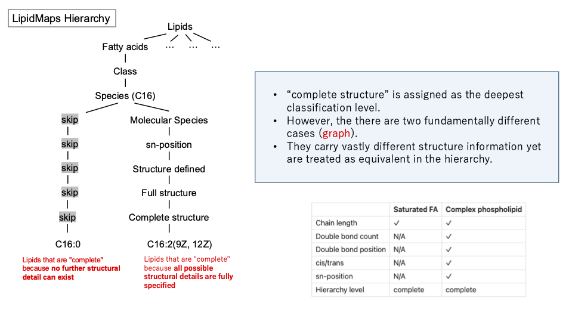
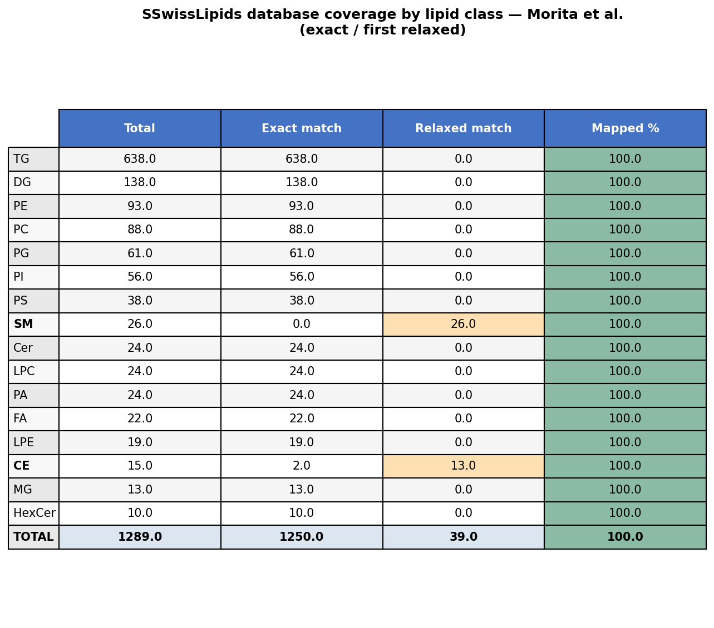
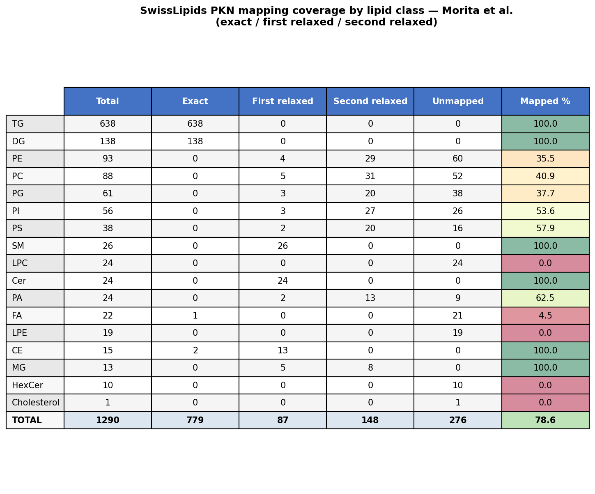

# Hierarchy 
### LipidMaps (8 classes)

| Level              | Example                             |
| ------------------ | ----------------------------------- |
| Category           | GP                                  |
| Class              | PE                                  |
| Species            | PE 32:2;O3                          |
| Molecular Species  | PE 16:1_16:1;O3                     |
| sn-position        | PE 16:1/16:1;O3                     |
| Structure defined  | PE 16:1(6)/16:0;(OH)2;oxo           |
| Full structure     | PE 16:1(6Z)/16:0;5OH,8OH;3oxo       |
| Complete structure | PE 16:1(6Z)/16:0;5OH[R],8OH[S];3oxo |

### SwissLipids (7 classes)

| Level                     | Example                                |
| ------------------------- | -------------------------------------- |
| Category                  | Glycerophospholipid                    |
| Class                     | Glycerophosphocholine                  |
| Class（subclass）           | Monoalkylmonoacylglycerophosphocholine |
| **Species**               | PC(O-36:5)                             |
| **Molecular subspecies**  | PC(O-16:1_20:4)                        |
| **Structural subspecies** | PC(P-16:0/20:4)                        |
| **Isomeric subspecies**   | PC(P-16:0/20:4(5Z,8Z,11Z,14Z))         |

---

# Result -feature space-
### LipidMaps 

| level                | n    | pct   |
| -------------------- | ---- | ----- |
| Species              | 110  | 8.5%  |
| Molecular subspecies | 1062 | 82.4% |
| Exact match          | 87   | 6.7%  |
| (unmatched)          | 30   | 2.3%  |

### Goslin

| lipid_level        | n    | pct   |
| ------------------ | ---- | ----- |
| Species            | 26   | 2.0%  |
| Molecular species  | 43   | 3.3%  |
| sn-position        | 1172 | 90.9% |
| structure defined  | 12   | 0.9%  |
| Full structure     | 1    | 0.1%  |
| Complete structure | 36   | 2.8%  |

### SwissLipids

| level                 | n    | pct   |
| --------------------- | ---- | ----- |
| Species               | 4    | 0.0%  |
| Molecular subspecies  | 1213 | 94.1% |
| Structural subspecies | 0    | 0.0%  |
| Isomeric subspecies   | 0    | 0.0%  |
| (unmatched)           | 72   | 5.9%  |

---
# Currently detected issues
### Problem
Some entries in the database are classified at SN_POSITION level despite using _ in their name (e.g. DG 12:0_16:1)
Per GOSLIN nomenclature, _ denotes unresolved sn-position (molecular species level), while / denotes resolved sn-position (sn-position level)
This is a conflict between the name and the level annotation

### Causes
Curation errors in the DB: name and level are managed independently
Legacy entries pre-dating GOSLIN standardization, where _ was used interchangeably with /

### Handling options
Trust the level, ignore the name — treat SN_POSITION entries as resolved; simple, but risks false confidence
Trust the name, override the level — downgrade _-named entries to MOLECULAR_SPECIES; GOSLIN-compliant, but discards DB curation intent
Flag the conflict — keep both, set level_inferred = MOLECULAR_SPECIES and level_source_conflict = True; safest, allows downstream handling

---

# Ambiguity in the 'Complete Structure' Classification

---

# Results -mapping-

### Travel the tree to change granurality level

| Lipid class | Exact                | First relaxed                    | Second relaxed                   |
| ----------- | -------------------- | -------------------------------- | -------------------------------- |
| TG          | `TG(12:0_14:0_18:2)` | -                                | -                                |
| DG          | `DG(12:0_16:0)`      | -                                | -                                |
| PE          | `PE(14:0_22:1)`      | `PE(14:0/22:1)`                  | `PE(14:0/22:1(9Z))`              |
| PC          | `PC(14:0_16:0)`      | `PC(14:0/16:0)`                  | `PC(14:0/18:1(9Z))`              |
| PG          | `PG(16:0_16:0)`      | `PG(16:0/16:0)`                  | `PG(16:0/16:1(9Z))`              |
| PI          | `PI(16:0_16:0)`      | `PI(16:0/16:0)`                  | `PI(16:0/16:1(9Z))`              |
| PS          | `PS(16:0_18:1)`      | `PS(16:0/18:1)`                  | `PS(16:0/18:1(9Z))`              |
| SM          | `SM 34:1`            | `SM(d18:1/16:0)`                 | -                                |
| LPC         | `LPC(14:1)`          | NaN | NaN |
| Cer         | `Cer(d18:1_14:0)`    | `Cer(d18:1/14:0)`                | -                                |
| PA          | `PA(16:0_16:1)`      | `PA(16:0/16:1)`                  | `PA(16:0/16:1(9Z))`              |
| FA          | `FA(14:1)`           | NaN | NaN |
| LPE         | `LPE(16:1)`          | NaN | NaN |
| CE          | `CE(16:1)`           | `CE(16:1(9Z))`                   | -                                |
| MG          | `MG(16:1)`           | `MG(16:0/0:0/0:0)`               | `MG(16:1(9Z)/0:0/0:0)`           |
| HexCer      | `HexCer(d18:1_16:0)` | NaN | NaN |
| Cholesterol | `Cholesterol`        | NaN | NaN |

### Lipids failed to match 
- No annotation of Lysophospholipid
	- LPC
	- LPE
- FA: Not many FA annotation 
- Cholesterol: No annotation
- HexCer: There are `GlcCer` and `GalCer` annotated but no annotation of HexCer

### Special case: HexCer, GlcCer and GalCer
- Glc and Gal are stereoisomers of hexose, differing only in the orientation of the hydroxyl group at C4
- $HexCer \supseteq {GlcCer, GalCer}$

|Abbreviation|Full Name|Sugar|Stereoisomer|
|---|---|---|---|
|GlcCer|Glucosylceramide|Glucose|β-Glc|
|GalCer|Galactosylceramide|Galactose|β-Gal|
|HexCer|Hexosylceramide|Glucose **or** Galactose|Unknown / Unresolved|

### Discussion 
- Absolute level unification is structurally infeasible 
- relative traversal (N steps down) is a more practical alternative

---

